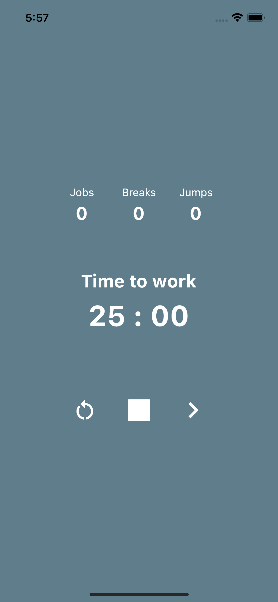
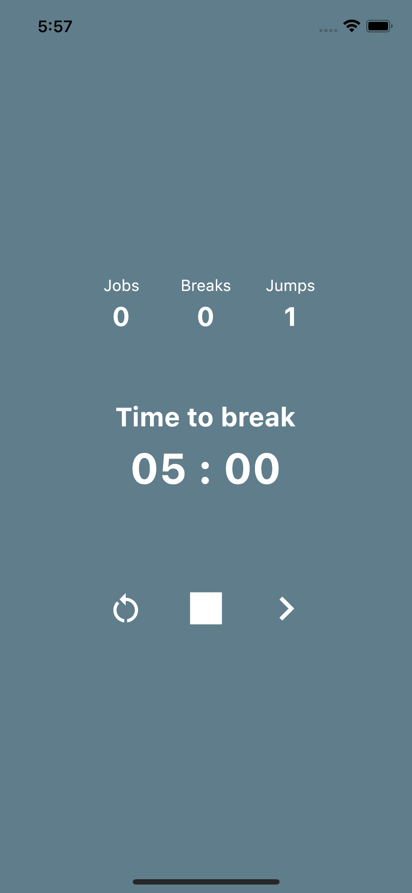

# Pomodoro App

Esta aplicación fue realizada como mi primera práctica con Flutter y  tiene como objetivo poner a prueba mis habilidades.

## 	Inicializar la App

Para inicializar este proyecto debes instalar Flutter en tu maquina, puedes ver la documentación [aqui](https://docs.flutter.dev/get-started/install?gclid=Cj0KCQjwpImTBhCmARIsAKr58czTFTvL4vt79qjxh3jTYZQl6vWHs40NIJ6Jdifixs18YxzZgstn9N0aAlaoEALw_wcB&gclsrc=aw.ds)

 

En esta aplicación tienes un contador que maneja dos estados diferentes, uno con 25 minutos el cual corresponde a tiempo productivo y 5 minutos que equivalen a tiempo de descanso. 

De la misma forma tendrás 3 botones los cuales te permitirán manejar la app.

| Doton | Descripcion |
| ----------- | ----------- |
| Restart | Te permite restaurar el tiempo de la sesión que tengas iniciada. |
| Stop -  Play  | te permite detener el contador o iniciarlo. |
| Next | Te permite saltar a la siguiente sesión.

[@maureDev](https://github.com/mouredev) Gracias por la motivacion.